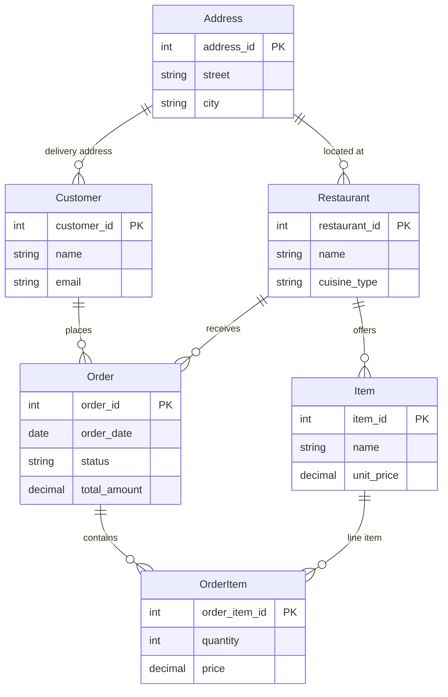

# Day 15 PM Part A — ER Diagram: Online Food Delivery App

## Entities (5+)

1. **Customer** — customer_id (PK), name, email, phone, address_id (FK)
2. **Address** — address_id (PK), street, city, pincode, landmark
3. **Restaurant** — restaurant_id (PK), name, address_id (FK), cuisine_type, rating
4. **Order** — order_id (PK), customer_id (FK), restaurant_id (FK), order_date, status, total_amount
5. **OrderItem** — order_item_id (PK), order_id (FK), item_id (FK), quantity, price
6. **Item** — item_id (PK), restaurant_id (FK), name, category, unit_price

## Relationships and Cardinality

- **Customer** —(1:N)— **Order**: One customer places many orders. (One order belongs to one customer.)
- **Restaurant** —(1:N)— **Order**: One restaurant has many orders. (One order is from one restaurant.)
- **Order** —(1:N)— **OrderItem**: One order has many order items. (Each order item belongs to one order.)
- **Item** —(1:N)— **OrderItem**: One item can appear in many order items. (Each order item references one item.)
- **Restaurant** —(1:N)— **Item**: One restaurant has many items. (Each item belongs to one restaurant.)
- **Customer** —(N:1)— **Address**: Many customers can share an address (e.g. same building). (Each customer has one default address.)
- **Restaurant** —(N:1)— **Address**: Many restaurants can share an area. (Each restaurant has one address.)

Cardinality: all relationships above are 1:N or N:1 as stated. Optional participation can be added (e.g. Order optional on Customer if we allow guest checkout).

## Diagram (Mermaid)

